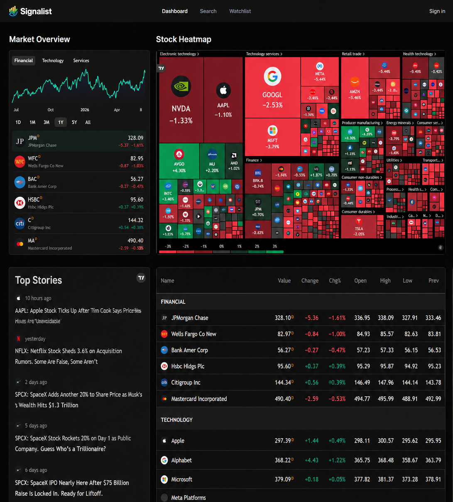

# 📈 Signalist — AI Powered Stock Analysis Platform

An intelligent stock market analysis platform built with Next.js 16, TradingView Widgets, Finnhub API, MongoDB, Better Auth, and AI-powered user personalization.

Designed for investors and traders who want real-time market insights, stock research tools, personalized watchlists, and a modern dashboard experience.

---

🌐 Live Preview




## 🌐 Live Demo

https://stock-analysis-app-ten.vercel.app/

---

## 🚀 Overview

Signalist helps investors discover market opportunities through real-time financial data, interactive stock visualizations, personalized watchlists, and AI-enhanced onboarding experiences.

The platform combines TradingView market widgets with Finnhub market intelligence APIs to deliver a fast and professional stock analysis experience.

---

## ✨ Core Features

### 📊 Real-Time Market Dashboard

Monitor market activity through embedded TradingView widgets:

* Market Overview
* Stock Heatmap
* Market Quotes
* Market News Timeline
* Live Market Insights

---

### 🔍 Stock Analysis

Dedicated stock pages provide:

* Symbol-based stock lookup
* Company market data
* Related market news
* TradingView charts
* Stock-specific insights

Example:

```bash
/stocks/AAPL
/stocks/TSLA
/stocks/NVDA
```

---

### 📰 Finnhub Market Intelligence

Powered by Finnhub APIs:

* Company News
* Market News
* Financial Data
* Real-Time Updates
* Multi-symbol News Aggregation

---

### ⭐ Personal Watchlists

Users can:

* Save favorite stocks
* Build custom watchlists
* Track companies of interest
* Manage investment research

---

### 🔐 Authentication System

Built with Better Auth.

Features:

* Secure Registration
* Login System
* Session Management
* Route Protection
* User Profiles

---

### 🤖 AI-Powered User Personalization

The platform generates personalized onboarding experiences based on:

* Investment Goals
* Risk Tolerance
* Preferred Industries
* Trading Experience
* Investment Timeline

This personalization is delivered through automated email workflows.

---

### 📧 Automated Email System

Powered by:

* Nodemailer
* Inngest Workflows

Capabilities:

* Welcome Emails
* Personalized User Messaging
* Automated Event Handling
* Future Notification Expansion

---

### ⚡ Background Jobs

Using Inngest:

* Event-driven workflows
* Async processing
* Email automation
* User onboarding pipelines

---

### 🌙 Modern User Experience

Built with:

* Tailwind CSS v4
* Shadcn UI
* Radix UI

Features:

* Responsive Design
* Dark Mode Support
* Accessible Components
* Mobile-Friendly Interface

---

## 🏗️ Tech Stack

### Frontend

* Next.js 16
* React 19
* TypeScript
* Tailwind CSS 4
* Shadcn UI
* Radix UI

### Backend

* Next.js App Router
* Server Actions
* API Routes

### Database

* MongoDB
* Mongoose

### Authentication

* Better Auth

### Financial Data

* Finnhub API
* TradingView Widgets

### Background Processing

* Inngest

### Email Services

* Nodemailer

### Deployment

* Vercel

---

## 📂 Project Architecture

```txt
app/
├── (root)
│   ├── page.tsx
│   └── stocks/[symbol]
│
├── auth
│   ├── sign-in
│   └── sign-up
│
└── api
    └── inngest

components/
├── TradingView
├── WatchlistButton
├── SearchCommand
├── Header
└── UserDropDown

database/
├── mongoose.ts
└── models
    └── watchlist.model.ts

lib/
├── actions
│   ├── finnhub.actions.ts
│   ├── auth.actions.ts
│   ├── user.actions.ts
│   └── watchlist.actions.ts
│
├── better-auth
├── inngests
└── nodemailer
```

---

## ⚙️ Environment Variables

Create:

```env
.env.local
```

```env
MONGODB_URI=

BETTER_AUTH_SECRET=
BETTER_AUTH_URL=

FINNHUB_API_KEY=
NEXT_PUBLIC_FINNHUB_API_KEY=

SMTP_HOST=
SMTP_PORT=
SMTP_USER=
SMTP_PASS=

GEMINI_API_KEY=
```

---

## 🛠️ Installation

Clone Repository

```bash
git clone https://github.com/dineshupadhyay08/Stock_Analysis_App.git
```

Install Dependencies

```bash
npm install
```

Run Development Server

```bash
npm run dev
```

Build Application

```bash
npm run build
```

Start Production Server

```bash
npm start
```

---

## 🔒 Security

* Protected User Sessions
* Secure Authentication
* Environment Variable Isolation
* Database Validation
* Server-Side Data Fetching

---

## 🎯 Future Roadmap

* Portfolio Tracking
* AI Stock Recommendations
* Technical Indicators
* Earnings Analysis
* Price Alerts
* Push Notifications
* Sentiment Analysis
* Stock Screener
* Portfolio Performance Analytics

---

## 👨‍💻 Author

Dinesh Upadhyay

Building modern fintech applications with Next.js, AI, and real-time market intelligence.

---

## ⭐ Support

If you found this project useful, consider giving the repository a star.
